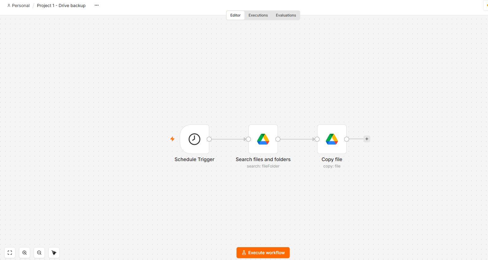
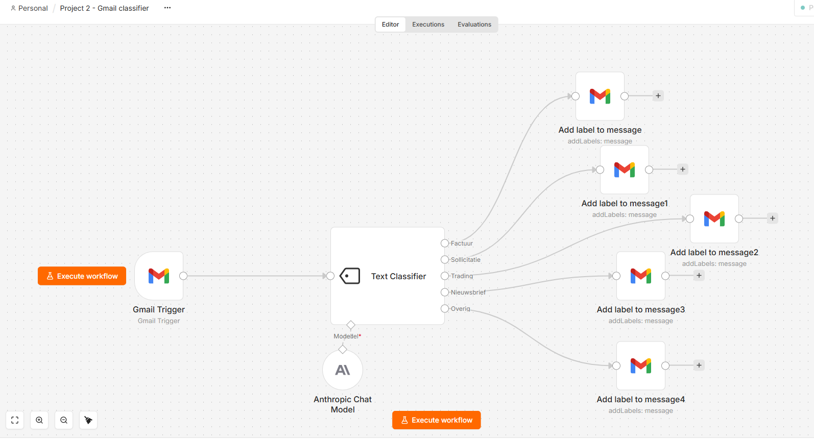
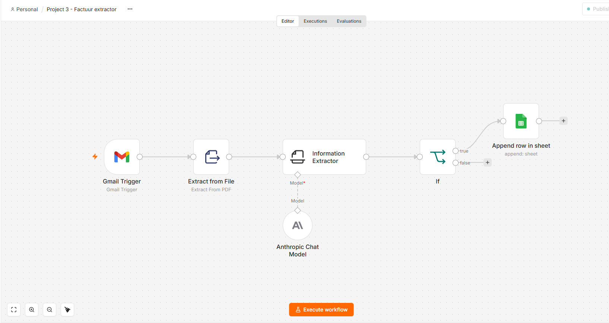

# n8n-portfolio

AI-automatiseringsworkflows, gebouwd in self-hosted n8n (Docker op Ubuntu Server). 
Elke workflow draait in productie op een eigen server en is hier als JSON-export beschikbaar.

**Technieken:** n8n · Docker Compose · Ubuntu Server · OAuth 2.0 (Google Cloud Console) · 
Gmail / Drive / Sheets API · Anthropic API (Claude) · JSON · Linux/SSH

---

## Project 1 — Google Drive backup
Dagelijkse geplande backup: kopieert alle bestanden uit een bronmap naar een backupmap.

- Schedule Trigger (dagelijks) → Drive Search → Drive Copy
- OAuth 2.0-credential via eigen Google Cloud-project
  

## Project 2 — Gmail AI-classificatie
Classificeert elke inkomende mail automatisch in vijf categorieën (Factuur, Sollicitatie, 
Trading, Nieuwsbrief, Overig) en zet het bijhorende Gmail-label.

- Gmail Trigger (polling elke 5 min) → Text Classifier (Claude Haiku) → Add Label per categorie
- Categoriebeschrijvingen fungeren als prompt; bijgestuurd op basis van echte mailstroom
  

## Project 3 — Factuur-extractor
Leest PDF-facturen uit inkomende mail, extraheert gestructureerde velden met AI en 
schrijft ze als rij naar een Google Sheet.

- Gmail Trigger (filter: PDF-bijlagen) → Extract from File (PDF→tekst) → 
  Information Extractor (8 attributen, getypeerd: Boolean/Number/String) → 
  IF (is_factuur) → Sheets Append/Update Row
- Herkent datumformaten en valuta (EUR/USD) correct

**Known limitations (bewust genoteerd):**
- Eén PDF-bijlage per mail wordt verwerkt (attachment_0)
-

## Achtergrond

Automatiseringservaring uit een eerder traject: 100+ NinjaTrader-strategieën (NinjaScript/C#) 
ontwikkeld met AI-ondersteunde workflow. [pas aan of verwijder naar smaak]

Contact: [je e-mailadres of LinkedIn-link]
