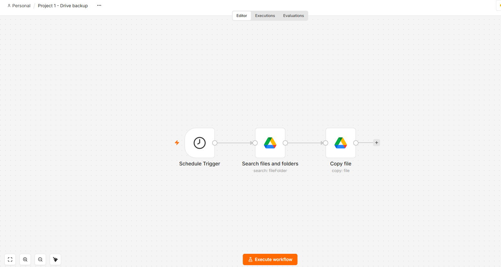
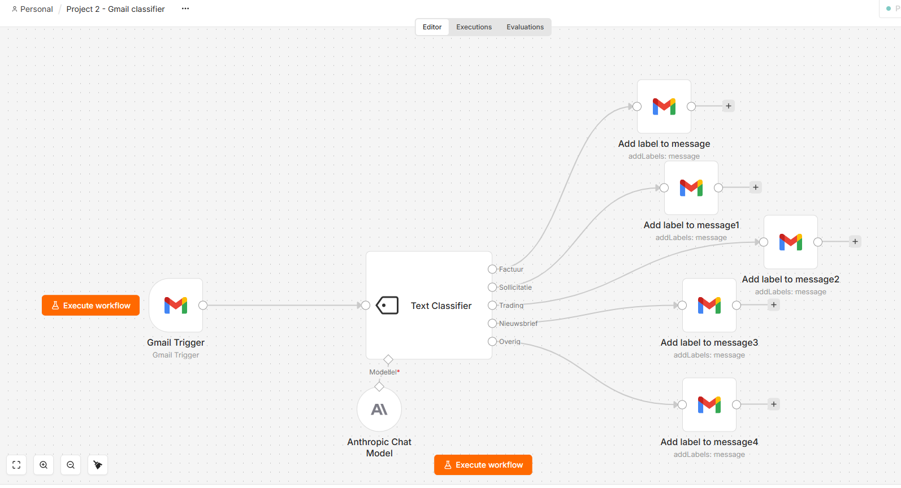
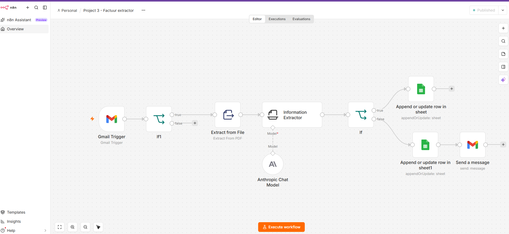
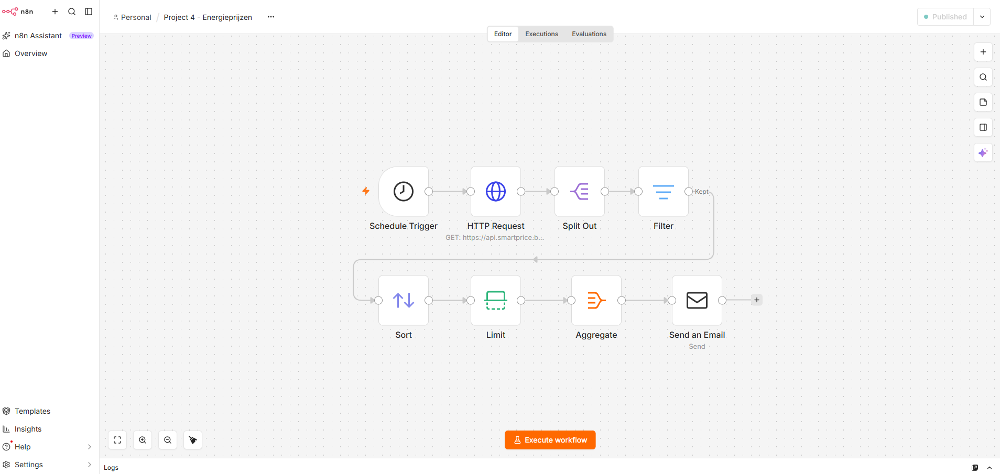
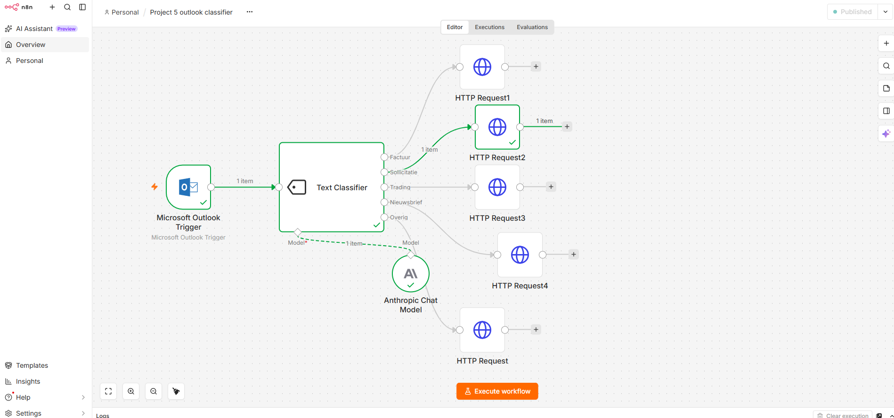
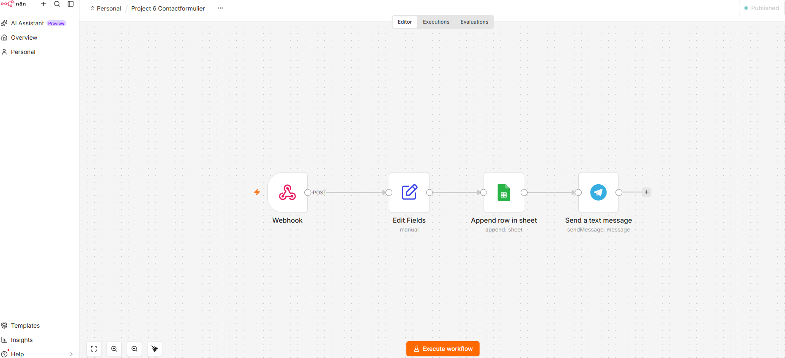
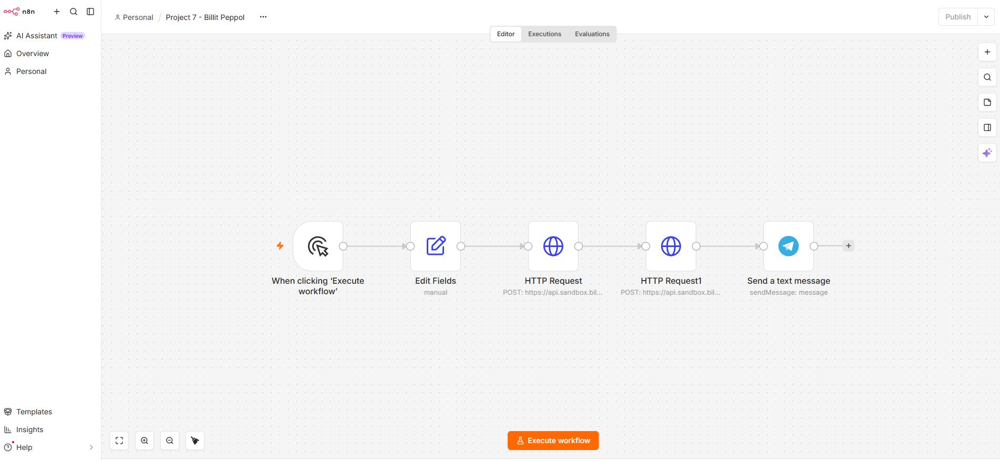
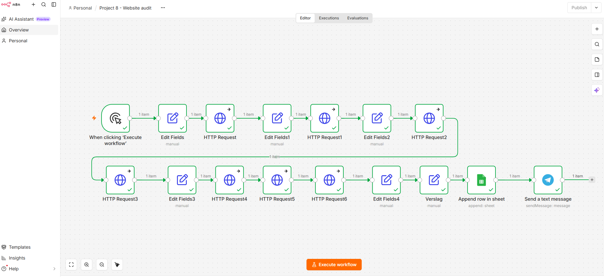

# n8n-portfolio

AI-automatiseringsworkflows, gebouwd in self-hosted n8n (Docker op Ubuntu Server). 
Elke workflow draait in productie op een eigen server en is hier als JSON-export beschikbaar.

**Technieken:** n8n · Docker Compose · Ubuntu Server · OAuth 2.0 (Google Cloud Console) · 
Gmail / Drive / Sheets API · Anthropic API (Claude) · JSON · Linux/SSH

---

## Project 1 — Google Drive backup
Dagelijkse geplande backup: kopieert alle bestanden uit een bronmap naar een backupmap.

- Schedule Trigger (dagelijks) → Drive Search → Drive Copy
- OAuth 2.0-credential via eigen Google Cloud-project
  

## Project 2 — Gmail AI-classificatie
Classificeert elke inkomende mail automatisch in vijf categorieën (Factuur, Sollicitatie, 
Trading, Nieuwsbrief, Overig) en zet het bijhorende Gmail-label.

- Gmail Trigger (polling elke 5 min) → Text Classifier (Claude Haiku) → Add Label per categorie
- Categoriebeschrijvingen fungeren als prompt; bijgestuurd op basis van echte mailstroom
  

# Project 3 – Factuur-extractor

Automatische verwerking van factuur-PDF's uit e-mail naar een overzichtelijke
Google Sheet, met ingebouwde rekencontrole en alarmering.

## Wat doet deze workflow?

1. **Gmail Trigger** – controleert elke minuut de mailbox op nieuwe berichten.
2. **Bijlagecheck (IF)** – mails zonder PDF-bijlage (nieuwsbrieven, vragen)
   worden genegeerd in plaats van fouten te veroorzaken.
3. **Extract from File** – haalt de tekst uit de PDF-bijlage.
4. **Information Extractor + Claude (Anthropic)** – leest 9 velden uit de
   factuur: datum, leverancier, factuurnummer, totaal, btw, totaal excl. btw,
   valuta, onderwerp en vervaldatum.
5. **Somcontrole (IF)** – rekent zelf na of totaal excl. + btw gelijk is aan
   het totaalbedrag (tolerantie 0.02 voor afrondingsverschillen). De AI wordt
   dus niet blind vertrouwd: de wiskunde controleert de AI.
6. **Google Sheets** – elke factuur komt als rij in de sheet, met status:
   - **OK** – de bedragen kloppen rekenkundig;
   - **CONTROLEREN** – de som wijkt af; de uitgelezen bedragen worden tóch
     weggeschreven zodat ze naast de originele PDF gelegd kunnen worden.
7. **Alarmmail** – bij een afwijking vertrekt automatisch een e-mail met
   leverancier, factuurnummer, de bedragen en de exacte afwijking.

Dubbele verwerking is uitgesloten: de sheet matcht op factuurnummer, dus een
factuur die twee keer binnenkomt wordt bijgewerkt, niet toegevoegd.

## Foutbewaking

Alle workflows zijn gekoppeld aan een centrale error-workflow
(Error Trigger → Telegram). Bij een technische fout (API onbereikbaar,
credential verlopen, …) komt er direct een Telegram-bericht binnen met de
naam van de workflow, de node en de foutmelding.

## Gebruikte nodes

| Node | Rol |
|------|-----|
| Gmail Trigger | Mailbox bewaken, bijlagen downloaden |
| If | Bijlagecheck en somcontrole |
| Extract from File | PDF naar tekst |
| Information Extractor + Anthropic Chat Model | AI-extractie van 9 velden |
| Google Sheets (Append or update row) | Opslag met duplicaatbescherming |
| Gmail (Send) | Alarmmail bij afwijking |
| Error Trigger + Telegram | Centrale foutbewaking |

## Opzet

- Self-hosted n8n (Docker)
- Credentials: Google (Gmail, Sheets), Anthropic API, Telegram Bot —
  credentials zitten **niet** in de workflow-JSON

# Project 4 — Energieprijzen België (dagelijkse mail)

Haalt elke avond de Belgische day-ahead stroomprijzen op en mailt
de drie goedkoopste kwartieren van morgen. Wie een dynamisch
energiecontract heeft, kan verbruik (laadpaal, boiler, machines)
naar die uren verschuiven.

## Wat de workflow doet

1. **Schedule Trigger** — dagelijks om 21:00 (de prijzen van morgen
   staan 's avonds in de API, zie Bijzonderheden)
2. **HTTP Request** — haalt de kwartierprijzen op bij SmartPrice.be
   (gratis, geen API-sleutel)
3. **Split Out** — splitst de lijst in losse items, één per kwartier
4. **Filter** — houdt alleen de kwartieren van morgen over (day = tomorrow)
5. **Sort** — sorteert op prijs (€/kWh), goedkoopste eerst
6. **Limit** — houdt de top 3 over
7. **Aggregate** — voegt de drie kwartieren samen tot één item,
   zodat er één mail vertrekt in plaats van drie
8. **Send Email** — mailt het overzicht via SMTP (eigen domein)

## Voorbeeld van de mail

    Goedkoopste kwartieren morgen:

    1. 13:45 — 0,132 €/kWh
    2. 13:30 — 0,136 €/kWh
    3. 14:15 — 0,138 €/kWh

    Bron: SmartPrice.be (Energy-Charts)

## Bijzonderheden

- **Kwartierprijzen**: de Belgische day-ahead markt werkt in
  kwartieren — 96 prijzen per dag, geen 24.
- **Tijdzone**: de API levert tijdstippen in UTC. De expression in
  de mailnode rekent om naar Belgische tijd met
  `DateTime.fromISO(...).setZone('Europe/Brussels')`, inclusief
  zomer/wintertijd.
- **Timing van de data**: overdag bevat de API alleen de prijzen
  van vandaag; die van morgen verschijnen pas 's avonds, na de
  day-ahead veiling. Daarom draait de workflow om 21:00. Een run
  vóór publicatie levert 0 items na de Filter op — de workflow
  stopt dan vanzelf, zonder foute mail.
- **Foutbewaking**: gekoppeld aan de centrale Error Workflow
  (Telegram-melding bij een mislukte run).

## Vereisten

- n8n (self-hosted)
- SMTP-credential van een eigen mailbox (hier: Vimexx, poort 465,
  SSL/TLS, gebruikersnaam = volledig e-mailadres)
- Vervang in de workflow het ontvangstadres door je eigen adres

## Databron

Prijsdata van [SmartPrice.be](https://smartprice.be), onderliggend
afkomstig van Energy-Charts (Fraunhofer ISE) — licentie CC BY 4.0.

## Project 5 — Outlook AI-classificatie
Sorteert inkomende Outlook-mail automatisch in mappen op basis van
AI-classificatie. Microsoft 365 is de standaard bij Belgische KMO's,
waardoor dit de zakelijk meest bruikbare variant van project 2 is.

- Microsoft Outlook Trigger (elke 5 min) → Text Classifier (Claude Haiku,
  5 categorieën) → HTTP Request per categorie (Microsoft Graph API)
- Eigen app-registratie in Microsoft Entra ID met OAuth2 en
  gedelegeerde Graph-rechten (Mail.ReadWrite, offline_access)
- De ingebouwde Outlook-node bleek het bericht-ID uit een expressie niet
  correct door te geven (bekend probleem, 400/ErrorInvalidIdMalformed).
  Na systematisch isoleren van de oorzaak vervangen door directe
  Graph-aanroepen via HTTP Request — daarmee werkt de volledige keten.

## Project 6 — Contactformulier (webhook)

Doel: berichten van een website-contactformulier automatisch registreren en melden.

Werking: Webhook (POST /contactformulier) ontvangt naam, e-mail en bericht als JSON → Edit Fields pakt de velden uit body en voegt een tijdstempel toe → Google Sheets (Append Row) registreert het bericht → Telegram stuurt direct een melding met de inhoud.

Nodes: Webhook → Edit Fields → Google Sheets → Telegram

Testen (Windows PowerShell): webhooks lokaal testen doe je met Invoke-RestMethod, niet met curl (aanhalingstekens raken verminkt):

powershell
$json = '{"naam":"Jan Test","email":"jan@test.be","bericht":"Dit is een proefbericht"}'
Invoke-RestMethod -Uri "http://localhost:5678/webhook-test/contactformulier" -Method Post -ContentType "application/json" -Body $json

Let op: in testmodus luistert de webhook per activering op precies één aanroep.

Status en bekende punten:

De workflow draait lokaal; publieke bereikbaarheid (koppeling met het echte formulier op de website) volgt na migratie naar een altijd-aan server.
Het webhook-pad is voor de testfase leesbaar (contactformulier); vóór publieke ingebruikname wordt dit onraadbaar gemaakt of beveiligd.
Afwerkpuntjes: tijdstempel staat in UTC (instantie-default), Telegram-melding toont regeleinden niet en bevat de n8n-attributieregel.

## Project 7 — Billit/Peppol e-facturatie (sandbox)

Doel: uit een binnenkomende bestelling automatisch een e-factuur aanmaken in Billit en verzenden via het Peppol-netwerk — de koppeling die sinds de Belgische B2B-e-facturatieplicht (1 jan 2026) voor elke KMO relevant is.

Werking: Manual Trigger (simuleert de webshop-bestelling; in een klantopzet vervangt een webhook deze stap, zoals in project 6) → Edit Fields met de bestelgegevens → HTTP Request POST /v1/orders maakt de factuur aan in Billit (authenticatie via API-key in header + partyID) → HTTP Request POST /v1/orders/commands/send geeft de verzendopdracht, met het OrderID dynamisch uit de vorige stap → Telegram-melding.

Nodes: Manual Trigger → Edit Fields → HTTP Request (aanmaken) → HTTP Request (verzenden) → Telegram

Aangetoond: REST-authenticatie met API-key/headers tegen een commercieel platform; factuur wordt aangemaakt en is zichtbaar in de Billit-sandbox (Income → Invoices); de Peppol-netwerkvalidatie werkt aantoonbaar (verzending naar een niet-geregistreerde ontvanger geeft correct TheCustomerIsNotActiveOnPeppol); zonder TransportType valt Billit terug op e-mailverzending.

Status: effectieve verzending vereist eenmalige accountverificatie (sms); die raakte in de sandbox niet afgerond — ticket bij Billit-support loopt. Workflow draait handmatig (geen publish nodig zonder automatische trigger).

Kanttekening: de API-key-route is door Billit alleen toegestaan voor eigen/niet-commercieel gebruik; een klantimplementatie vereist OAuth of het integratiepartner-traject

## Project 8 – Website audit

**Wat het doet:** één domein ingeven → de workflow controleert automatisch snelheid, HTTPS en e-mailbeveiliging (SPF, DMARC, DKIM) → resultaten in een Google Sheet en een samenvatting op Telegram. Bedoeld als motor achter een "gratis website-audit" voor KMO's.

**Flow:** Manual Trigger → Edit Fields (domein) → HTTP Request (Google PageSpeed API) → Edit Fields (snelheidsscore) → HTTP Request (https://domein) → Edit Fields (https ✓/✗ + statuscode) → 2× HTTP Request (Google DNS: TXT-records domein + _dmarc) → Edit Fields (SPF, DMARC, beleid) → 3× HTTP Request (Google DNS: DKIM-selectors google, selector1, default) → Edit Fields (DKIM ✓/✗ + selector) → Edit Fields "Verslag" (alle resultaten in één rij) → Google Sheets (Append Row) → Telegram

**Technieken:**
- Meerdere externe bronnen in één workflow samenbrengen (PageSpeed API, Google DNS-over-HTTPS, eigen HTTP-check) en er één verslag van maken
- API-key als query-parameter (PageSpeed) in plaats van in een header; key beperkt tot één API in Google Cloud
- Foutafhandeling per node: "On Error: Continue" en "Never Error" zodat een 403, 404 of onbestaand domein een auditresultaat wordt in plaats van een crash
- Verwijzingen naar eerdere nodes met `$('Nodenaam').item.json` om resultaten uit de hele keten te verzamelen
- JavaScript-expressies voor de checks, bv. `Answer.some(a => a.data.includes('v=spf1'))`

**Voorbeeldresultaat (standaard.be):** snelheid mobiel 34/100 · HTTPS ✓ (403, Cloudflare-botbescherming) · SPF ✓ · DMARC ✓ (p=reject) · DKIM ✓ (selector1)

**Gekende beperkingen:**
- HTTPS-check kijkt of de server over https antwoordt, ongeacht de statuscode; een 403 door botbescherming telt als ✓
- DKIM wordt alleen gezocht onder de selectors `google`, `selector1` en `default`; andere selectors geven "niet gevonden onder gangbare selectors"
- PageSpeed-scores schommelen per meting (28–42 bij dezelfde site)
- In de JSON is de PageSpeed-key vervangen door `HIER_JE_KEY`

## Achtergrond

Automatiseringservaring uit een eerder traject: 100+ NinjaTrader-strategieën (NinjaScript/C#) 
ontwikkeld met AI-ondersteunde workflow. 

Contact: lotusflow.contact@gmail.com
